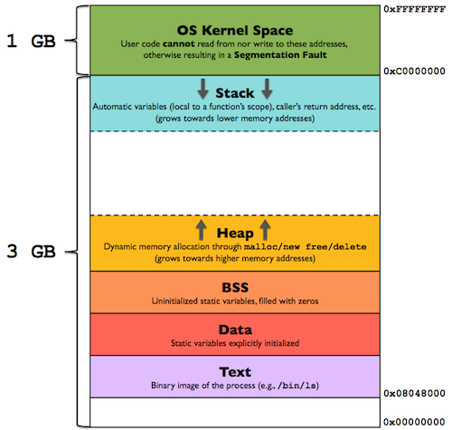

## The Linux Process Memory Layout

Before I could start understanding what is the `.data` section in these
assembly programs, I had to first learn about how a process is placed in
memory by Linux.

Linux works with [virtual memory](https://en.wikipedia.org/wiki/Virtual_memory).
This means that each process has its own *address space*, but these addresses
do not necessarily correspond to physical addresses of the system's RAM.
Each process can "see" 4GB of addresses, from `0x0` to `0xFFFFFFFF` (32 bits).
Each address is the address of 1 particular byte of memory. The process is
organized in memory according to the picture below:

([image source](https://gabrieletolomei.wordpress.com/miscellanea/operating-systems/in-memory-layout/))

As you can see, the `.text` and `.data` segments are almost at the bottom
of this memory region, after a small offset. This happens when we execute our
programs directly. If your program is a shared library, however (for example,
like the program we made that are called by `caller.c`), these programs
will be loaded in the space that is in white in the picture, between the heap
and the stack.

This is important because, if you tried to compile some of these programs
that are called by `caller.c` with a data section, you might have had some
linking errors. Try to run:

    ./caller_c data problem
    /usr/bin/ld: bin/problem.o: relocation R_X86_64_32S against `.data' can 
    not be used when making a PIE object; recompile with -fPIC
    /usr/bin/ld: final link failed: Nonrepresentable section on output
    collect2: error: ld returned 1 exit status

It was easy to fix this error, as you can see in the comments in the
source of `problem.asm`. But it took me *a lot* of time to understand *why* 
this error was happening. The answer has to do with this memory layout above.

When we run a program that executes directly, it "knows" where it will be
placed in memory, because the address space is virtual, so every process has
its own address `0x08048000` (or whatever other address). Because of this,
the linker can replace all labels inside our executable with direct (fixed)
addresses.

The situation for libraries (like `problem.asm`) is not quite the same.
A library will be loaded inside the process address space of other processes.
Because of that, it doesn't know, at linkage time, what addresses to use in
the place of variables. There are two ways to solve this. One is what we have
done, which is to make what is called *position independent code*, a code
that can be executed successfully at any location in memory. The `rel`
keyword tells the assembler to replace the absolute address of the "variable"
`a_byte` with a *relative* address. Relative to what? Relative to the
instruction pointer (**RIP**) register, a register that stores the location
of the next instruction being executed.

The other solution is to disable the position independent executable option
in `gcc` by passing the option `-no-pie`. In this way, `gcc` will not try
to generate a position independent executable, so it is okay to leave the
fixed addresses, but our code won't be able to run at any position in memory.
This seems to be discouraged nowadays.

PS: I am not 100% of the correctness of the explanation above.
