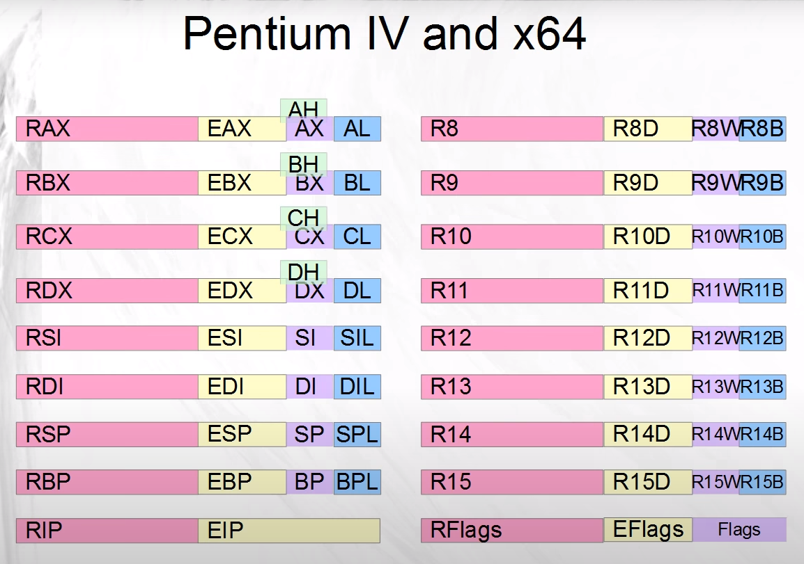

These are the (so-called "general purpose") registers in the x64 architecture:

(Image taken from [this video](https://www.youtube.com/watch?v=Dh7GQ_joeE4).)

In x64 (or x86_64) archtecture, the registers have a size of 64 bits or
8 bytes each. As we can see, each register is also divided into smaller parts.
Take for example the **RAX** register, which is a whole 64-bit register.
The lower half of **RAX** is called **EAX** and 
it can be treated more or less like a register itself. **EAX** has 32 bits or
4 bytes. Similarly, the lower half of **EAX** is **AX**, a 16-bit 
register (or 2 bytes). **AX** is divided into 2 registers: **AL** 
(the lower 8-bit register) and **AH** (the higher 8-bit register).

The lower halfs of the registers on the left side of the picture already 
existed in the previous 32-bit x86 archtecture. They have been expanded to
64 bits, and moreover, all the other registers on the right side of the picture
have been added.

All these registers can be used by us in our assembly code, but we will see
later that some of those (like **RIP** and **RFlags**) are not *really* general 
purpose.
